<div align="center">


<br/>

<a href="https://gigacrabs.com"></a>
<a href="mailto:hello@gigacrabs.com"></a>


</div>


## 🦀 Hello from the shore

**GigaCrabs** is a new technology startup building practical software, AI systems, SaaS products, and developer tools, designed to make modern technology easier to create, use, and scale.

Small team. Serious engineering.



## 🛠️ What we build

| | Focus | What it means |
|---|---|---|
| 🧱 | **Software & SaaS** | Modern applications and reusable foundations built with security, maintainability, and growth in mind. |
| 🤖 | **AI Systems** | AI integrations, agents, automation, and intelligent systems designed around practical use cases. |
| 🔧 | **Developer Tools** | Tools that remove unnecessary complexity and help people create better software. |

## 🚧 On the workbench

**AI SaaS Foundation** is our first product, currently in development: a production-oriented foundation for building modern SaaS applications, with strong architecture, security, AI readiness, and developer experience from the beginning.



## 🧭 How we scuttle

| | Principle | |
|---|---|---|
| 🎯 | **Useful first** | Solve real problems. |
| 🔒 | **Built properly** | Security and quality matter. |
| ✨ | **AI-native** | AI is part of our workflow: research, coding, testing, docs, debugging. The people building it stay responsible for the result. |
| 🤝 | **Stay honest** | No imaginary achievements. |

## 🧠 The crab manifest

```ts
const gigacrabs = {
  motto: "Building technology worth using.",
  walks: "sideways, but always shipping",
  principles: ["useful first", "built properly", "AI-native", "stay honest"],
  currentlyBuilding: "AI SaaS Foundation",
  fuel: ["coffee", "curiosity", "a little AI"],
  contact: "hello@gigacrabs.com",
};
```

<details>
<summary><b>🦀 Click for crab facts (you've earned them)</b></summary>

<br/>

- Crabs have ten legs. That's the "deca" in *decapod* (the claws count as a pair).
- Most crabs walk sideways because of how their leg joints bend, which is exactly how we like to approach problems: from an unexpected angle, and still moving forward.
- A group of crabs is called a *cast*. Ours is small, but it ships.
- Crabs grow by molting: shedding the old shell and building a bigger one. We call that refactoring.

</details>

## 📬 Say hi

Questions, ideas, or want to build something together? Email **[hello@gigacrabs.com](mailto:hello@gigacrabs.com)** or visit **[gigacrabs.com](https://gigacrabs.com)**.


