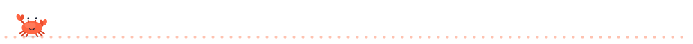

 

## 🦀 Hello from the shore

**GigaCrabs** is a new technology startup building practical software, AI systems, SaaS products, and developer tools, designed to make modern technology easier to create, use, and scale.

Small team. Serious engineering.

## 🛠️ What we build

| | Focus | What it means |
|---|---|---|
| 🧱 | **Software & SaaS** | Modern applications and reusable foundations built with security, maintainability, and growth in mind. |
| 🤖 | **AI Systems** | AI integrations, agents, automation, and intelligent systems designed around practical use cases. |
| 🔧 | **Developer Tools** | Tools that remove unnecessary complexity and help people create better software. |

## 🚧 On the workbench

**AI SaaS Foundation** — our first product, currently in development. A production-oriented foundation for building modern SaaS applications, with strong architecture, security, AI readiness, and developer experience from the beginning.

- [x] Modern full-stack architecture
- [x] Authentication & organizations
- [x] RBAC & security foundations
- [x] AI-ready infrastructure

## 🧭 How we scuttle

| | Principle | |
|---|---|---|
| 🎯 | **Useful first** | Solve real problems. |
| 🔒 | **Built properly** | Security and quality matter. |
| ✨ | **AI-native** | AI is part of our workflow: research, coding, testing, docs, debugging. The people building it stay responsible for the result. |
| 🤝 | **Stay honest** | No imaginary achievements. |

## 📬 Say hi

Questions, ideas, or want to build something together? Email **[gigacrabs.team@gmail.com](mailto:gigacrabs.team@gmail.com)** or visit **[gigacrabs.com](https://gigacrabs.com)**.

Built with care (and a little AI) by the GigaCrabs team 🦀

